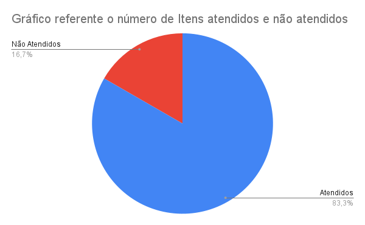

# Verificação da Análise de Tarefas

## 1. Introdução

Neste artefato será feita a verificação da
[Análise de Tarefas](/analise_de_requisitos/analise_de_tarefas.md) utilizando a metodologia e as estratégias descritas no documento
de [*Verificação*](../verif_principal.md)

- Autor(es) do documento: Arthur José e Nícolas Georgeos Mantzos.
- Inspetor: Leonardo Vitoriano.

## 2. Verificação

### 2.1 Preparação

Tendo como base a definição de Barbosa (2021) sobre as principais características e elementos no qual uma Análise de Tarefas deve conter, foi possível criar uma checklist para avaliar o artefato de Análise de Tarefas.

O *checklist* da tabela 1 foi montado para verificar a qualidade do artefato.

| Item                                                                  | Identificador |
| --------------------------------------------------------------------- | ------------- |
| O documento possui versionamento?                                     |      1        |
| Existe uma introdução ao conceito abordado?                           |      2        |   
| Há uma ordem lógica entre as estruturas?                              |      3        | 
| Elementos gráficos estão acompanhados de legendas?                    |      4        |   
| As tarefas possuem um objetivo?                                       |      5        |      
| Foram utilizadas técnicas para especificar as tarefas?                |      6        |    
| As tarefas do HTA estão no modelo conceitual?                         |      7        |      
| O diagrama HTA está coerente?                                         |      8        |             
| Existe tabela explicando os elementos do diagrama HTA?                |      9        |    
| As tarefas do CMN-GOMS estão no modelo conceitual?                    |      10       |      
| O diagrama CMN-GOMS está coerente?                                    |      11       |          
| Existe tabela explicando os elementos do diagrama CMN-GOMS?           |      12       |      
_Tabela 1: Itens e identificadores da verificação da Análise de Tarefas_

### 2.2 Inspeção

O resultado do checklist dos itens levantados consta na _tabela 2_ abaixo.

| Item                                                              | Situação |
|:------------------------------------------------------------------|:--------:|
| 1  |    ✅    |
| 2  |    ✅    |            
| 3  |    ✅    |
| 4  |    ✅    |
| 5  |    ✅    |
| 6  |    ✅    |    
| 7  |    ❌    |    
| 8  |    ✅    |
| 9  |    ❌    |    
| 10 |    ✅    |                
| 11 |    ✅    |
| 12 |    ✅    |  

_Tabela 2: Checklist de Verificação do Artefato: Análise de Tarefas_

O gráfico de pizza compilando a porcentagem de itens atendidos e não atendidos consta na _figura 1_ abaixo.

|  |
|---------------------------------------------------------|
| Figura 1: Gráfico de Itens atendidos e não atendidos    |

Tomando como base a checklist construída, observa-se que o artefato está bom, mas carece de atenção quanto ao item 7, tarefas do HTA não estarem no modelo conceitual, e item 9, não existe tabela explicando os elementos do diagrama HTA, portanto, esses itens precisam ser corrigidos.

### 2.3 Correção

Para a fase de correção um membro do grupo será escolhido para realizar as correções apontadas na Análise de Tarefas.

### 2.4. Acompanhamento

O membro Leonardo Vitoriano será o responsável por acompanhar a tarefa de correção do membro definido no item anterior e
assim realizar uma nova inspeção para fiscalização dos itens que foram apontados como não atendidos.

## Referências Bibliográficas

Barbosa, S. D. J.; Silva, B. S. da; Silveira, M. S.; Gasparini, I.; Darin, T.; Barbosa, G. D. J. (2021)
Interação Humano-Computador e Experiência do usuário. Autopublicação. ISBN: 978-65-00-19677-1.R

## Histórico de Versões

| Versão | Data       | Descrição           | Autor             |
| ------ | ---------- | ------------------- | ----------------- |
| 1.0    | 21/08/2022 | Criação do Artefato | Leonardo Vitoriano |
| 1.1    | 22/08/2022 | Refatorando para modelo único de verificação | Leonardo Vitoriano |