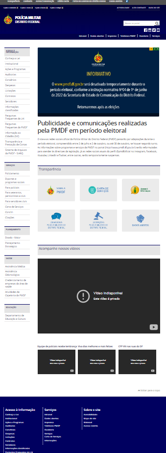
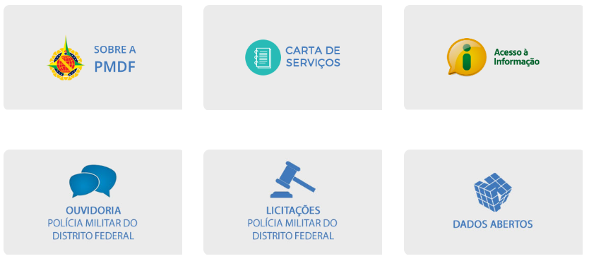
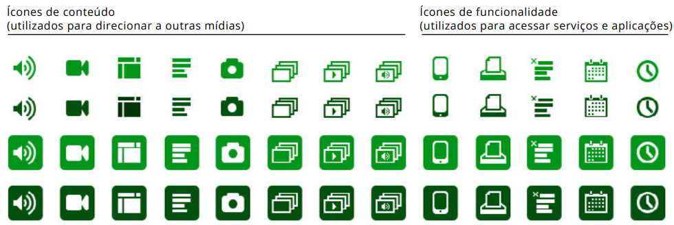

# Guia de Estilo

## 1. Introdução

O guia de estilo trata de um registro das principais decisões de design tomadas, de forma que elas não se percam, isto é, sejam efetivamente
incorporadas no produto final. Guias de estilo servem de ferramenta de comunicação entre os membros da equipe de design e também com a equipe
de desenvolvimento. É importante que as decisões de design possam ser facilmente consultadas e reutilizadas nas discussões sobre extensões ou
versões futuras do produto.

Um guia de estilo deve incorporar decisões de design envolvendo os principais elementos e considerações de design de interface. Marcus (1991)
considera os seguintes elementos:

- layout: porporção e grids; uso de metáforas espaciais; design gráfico de exibidores e ferramentas;
- tipografia e seu uso em diálogos, formulários e relatórios;
- simbolismo: clareza e consistência, formulários e relatórios;
- cores: os dez mandamentos sobre o uso das cores;
- visualização de informação: design de gráficos, diagramas e mapas;
- design de telas e elementos de interface (widgets).

## 2. Considerações

O desenvolvimento de desse artefato se deu com intermédio do Guia de Estilo do Portal Institucional Padrão, uma vez que
o site análisado é institucional, e por isso deve seguir padrões estipulados pelo Guia. Desse modo, toda a análise do site
foi feita levando o "Guia de Estilo do Portal Institucional Padrão" em consideração.

## 3. Análise

### 3.1 Layout

O layout do site da PMDF (Figura 1) é disposto em uma grid (Figura 2), onde pode ser identificado 4 partes:

1. Menu Lateral
2. Área de Conteúdo
3. Cabeçalho
4. Rodapé

|               |                                         |
| :-----------------------------------------------------------------: | -------------------------------------------------------------------------------------------- |
| Figura 1: Foto do site da PMDF; Fonte: http://www.pmdf.df.gov.br/ . | Figura 2: Exemplo de Grid; Fonte: Pág 15 do "Guia de Estilo do Portal Institucional Padrão". |

> Conclusão: Esse layout é simples e funcional, visto que as informações em destaque de cada página estarão
> visíveis no centro da tela. Também vale mencionar que estilo de grid padrão estabelecido pelo "Guia de Estilo do Portal Institucional Padrão".

### 3.2 Tipografia

O site usa 3 fontes principais: Open Sans, Arial e Myriad Pro.

- A fonte Open sans é utilizada na maioria do site, títulos, subtitulos, textos corridos, menus.
- A fonte Arial é somente em um menu de navegação pela página.
- A fonte Myriad Pro é usada no menu de navegação para outros site do governo.

|                                          |
| :-------------------------------------------------------------------------------------------------: |
| Figura 3: Recomendação de fontes; Fonte: Pág 25 do "Guia de Estilo do Portal Institucional Padrão". |

> Conclusão: Apesar do site utilizar da fontes recomendadas pelo Guia de Estilo do Portal Institucional Padrão, as recomendações quando à
> detalhada dessas fontes não é seguida, como pode ser observado na _Figura 3_. A fonte Open Sans é utilizada em títulos de páginas, títulos de módulos e links de navegação - itens
> de menu, links de cabeçalho (header), rodapé (footer), módulos, etc. - e textos secundários. A fonte Arial é utilizada em chamadas, linhas finas
> e textos corridos.(Guia de Estilo do Portal Institucional Padrão)

### 3.3 Simbolismo
O site utiliza ícones para direcionar o usuário a outras mídias (Figura 4) e ícones para acessar serviços e aplicações (Figura 5). O acesso
a outras páginas do site não possuem ícones.

|                                      |                                         |
|:--------------------------------------------------------------------------------------:|-------------------------------------------------------------------------------------------|
| Figura 4: ícone que direciona para outras mídias; Fonte:  http://www.pmdf.df.gov.br/ . | Figura 5: ícones para acessar serviços e aplicações; Fonte:  http://www.pmdf.df.gov.br/ . |

|                                                   |
|:---------------------------------------------------------------------------------------------------:|
| Figura 6: Recomendação de icones; Fonte: Pág 31 do "Guia de Estilo do Portal Institucional Padrão". |

> Conclusão: O site possui exemplos de aplicação de ícones, no entanto não são ícones padronizados e não são utilizados amplamente em todo o site.
> Segundo o Guia a utilização de pictogramas auxiliam no entendimento do conteúdo, por isso é importante ter em mente os casos de utilização deles (Figura 6).
> É importante salientar que para os casos nos quais não existam ícones pré-estabelecidos, os mesmos poder ser criados baseando-se na utilização de no máximo
> duas cores (quando cercado de quadrado colorido), na simplicidade e na manutenção de áreas de respiro, como presentes nos ícones da _Figura 6_.

### 3.4 Cores
As cores seguem o padrão definido pelo Guia de Estilo do Portal Institucional Padrão, como referenciado na figura 7 e comparado a figura 8.

| |  |
|:---------------------------------------------------------------------------------------------------:|:---------------------------------------------------------------------------------------------------:|
| Figura 7: Tema azul; Fonte: Pág 60 do "Guia de Estilo do Portal Institucional Padrão". | Figura 8: Imagem Site PMDF; Fonte:  http://www.pmdf.df.gov.br/ . |

A logo do site PMDF pode ser encontrada no site da pmdf, onde é composto por um brasão circular em azul blau e as 26 estrelas, onde só aparecem 12, há um escudo na frente com cores amarelo jalde e vermelho goles, e representando a parte triangular  verde (sinopla) e  amarelo (jalne), 

|                                                   |
|:---------------------------------------------------------------------------------------------------:|
| Figura 9: Logo PMDF. Fonte: http://www.pmdf.df.gov.br/  |

A Paleta de cores é referenciada abaixo pela figura 10, como podemos ver as cores primárias utilizadas no site, aquelas que estão presentes em todo o site, em seguida, as cores secundárias encontradas no site.

| Figura 10: Paleta de cores site PMDF.|

|                                                  |
|:---------------------------------------------------------------------------------------------------:|
| Figura 10: Paleta de cores site PMDF.|

### 3.5 Visualização de Informação

Para o Estilos de interação, Utiliza liguangens de natural e de comando e interação por menus e imagens, e WIMP(Windows Icons Menu and pointers)

****Seleção de um estilo****

O site dispoe do estilo de interação por menu, e WIMP.

Aceleradores.

O site dispoe de uma barra de pesquisa avançada. facilitando usuários a buscarem rápidamente sobre o site.

|                                                 |
|:---------------------------------------------------------------------------------------------------:|
| Figura 11: busca avançada PMDF. Fonte:http://www.pmdf.df.gov.br/ |

### 3.6 Design de Telas e Elementos de Interface

Design de telas e elementos da interface (widgets), Descrevem os principais componentes da tela que o usuário terá acesso.

Podemos perceber 6 Elementão e são eles:

#### 3.6.1 Barra padrão

|[image](https://user-images.githubusercontent.com/60429513/182257643-1cd5dcbe-a657-4025-af49-d532f4c5af7a.png)|
|:---------------------------------------------------------------------------------------------------:|
| Figura 12: Barra padrão. Fonte: http://www.pmdf.df.gov.br/ |

#### 3.6.2 Header

||
|:---------------------------------------------------------------------------------------------------:|
| Figura 13: Header PMDF. Fonte: http://www.pmdf.df.gov.br/ |

#### 3.6.3 Coluna de Menus

||
|:---------------------------------------------------------------------------------------------------:|
| Figura 14: Coluna de Menus PMDF. Fonte: http://www.pmdf.df.gov.br/ |

#### 3.6.4 Miolo

||
|:---------------------------------------------------------------------------------------------------:|
| Figura 15: Miolo PMDF. Fonte: http://www.pmdf.df.gov.br/ |

#### 3.6.5 Rodapé

||
|:---------------------------------------------------------------------------------------------------:|
| Figura 16: Rodapé PMDF. Fonte: http://www.pmdf.df.gov.br/ |

#### 3.6.6 Barra inferior

||
|:---------------------------------------------------------------------------------------------------:|
| Figura 11: Barra inferior PMDF. Fonte:http://www.pmdf.df.gov.br/ |

## Referências Bibliográficas

Barbosa, S. D. J.; Silva, B. S. da; Silveira, M. S.; Gasparini, I.; Darin, T.; Barbosa, G. D. J. (2021)
Interação Humano-Computador e Experiência do usuário. Autopublicação. ISBN: 978-65-00-19677-1.R

## Histórico de Versões

| Versão | Data       | Descrição                                                            | Autor             |
| ------ | ---------- | -------------------------------------------------------------------- | ----------------- |
| 1.0    | 27/07/2022 | Criação da página e introdução                                       | Bernardo Pissutti |
| 1.1    | 28/07/2022 | Adição da secão "considerações" e documentação do layout, tipografia | Bernardo Pissutti |
| 1.2    | 01/08/2022 | Criação de Cores,VIsualização de Informação, Design de Telas e Elementos de Interface  | Arthur José |
