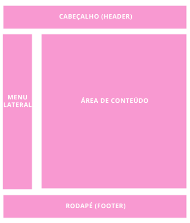

# Guia de Estilo

## 1. Introdução

O guia de estilo trata de um registro das principais decisões de design tomadas, de forma que elas não se percam, isto é, sejam efetivamente
incorporadas no produto final. Guias de estilo servem de ferramenta de comunicação entre os membros da equipe de design e também com a equipe
de desenvolvimento. É importante que as decisões de design possam ser facilmente consultadas e reutilizadas nas discussões sobre extensões ou
versões futuras do produto.

Um guia de estilo deve incorporar decisões de design envolvendo os principais elementos e considerações de design de interface. Marcus (1991)
considera os seguintes elementos:
- layout: porporção e grids; uso de metáforas espaciais; design gráfico de exibidores e ferramentas;
- tipografia e seu uso em diálogos, formulários e relatórios;
- simbolismo: clareza e consistência, formulários e relatórios;
- cores: os dez mandamentos sobre o uso das cores;
- visualização de informação: design de gráficos, diagramas e mapas;
- design de telas e elementos de interface (widgets).

## 2. Considerações
O desenvolvimento de desse artefato se deu com intermédio do Guia de Estilo do Portal Institucional Padrão, uma vez que
o site análisado é institucional, e por isso deve seguir padrões estipulados pelo Guia. Desse modo, toda a análise do site 
foi feita levando o "Guia de Estilo do Portal Institucional Padrão" em consideração.

## 3. Análise

### 3.1 Layout
O layout do site da PMDF (Figura 1) é disposto em uma grid (Figura 2), onde pode ser identificado 4 partes:
1. Menu Lateral
2. Área de Conteúdo
3. Cabeçalho
4. Rodapé

|               |                                         |
|:-------------------------------------------------------------------:|----------------------------------------------------------------------------------------------|
| Figura 1: Foto do site da PMDF; Fonte: http://www.pmdf.df.gov.br/ . | Figura 2: Exemplo de Grid; Fonte: Pág 15 do "Guia de Estilo do Portal Institucional Padrão". |

> Conclusão: Esse layout é simples e funcional, visto que as informações em destaque de cada página estarão 
> visíveis no centro da tela. Também vale mencionar que estilo de grid padrão estabelecido pelo "Guia de Estilo do Portal Institucional Padrão".

### 3.2 Tipografia
O site usa 3 fontes principais: Open Sans, Arial e Myriad Pro.
- A fonte Open sans é utilizada na maioria do site, títulos, subtitulos, textos corridos, menus.
- A fonte Arial é somente em um menu de navegação pela página.
- A fonte Myriad Pro é usada no menu de navegação para outros site do governo.

|                                          |
|:---------------------------------------------------------------------------------------------------:|
| Figura 3: Recomendação de fontes; Fonte: Pág 25 do "Guia de Estilo do Portal Institucional Padrão". |

>Conclusão: Apesar do site utilizar da fontes recomendadas pelo Guia de Estilo do Portal Institucional Padrão, as recomendações quando à
> detalhada dessas fontes não é seguida, como pode ser observado na _Figura 3_. A fonte Open Sans é utilizada em títulos de páginas, títulos de módulos e links de navegação - itens
> de menu, links de cabeçalho (header), rodapé (footer), módulos, etc. - e textos secundários. A fonte Arial é utilizada em chamadas, linhas finas
> e textos corridos.(Guia de Estilo do Portal Institucional Padrão)

### 3.3 Simbolismo

### 3.4 Cores

### 3.5 Visualização de Informação

### 3.6 Design de Telas e Elementos de Interface

## Referências Bibliograficas

Barbosa, S. D. J.; Silva, B. S. da; Silveira, M. S.; Gasparini, I.; Darin, T.; Barbosa, G. D. J. (2021)
Interação Humano-Computador e Experiência do usuário. Autopublicação. ISBN: 978-65-00-19677-1.R

## Histórico de Versões

| Versão | Data       | Descrição                                                                 | Autor               |
|--------|------------|---------------------------------------------------------------------------|---------------------|
| 1.0    | 27/07/2022 | Criação da página e introdução                                            | Bernardo Pissutti   |
| 1.1    | 28/07/2022 | Adição da secão "considerações" e documentação do layout, tipografia      | Bernardo Pissutti   |
