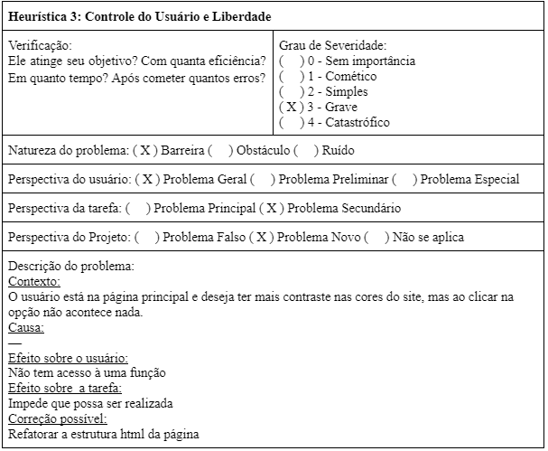
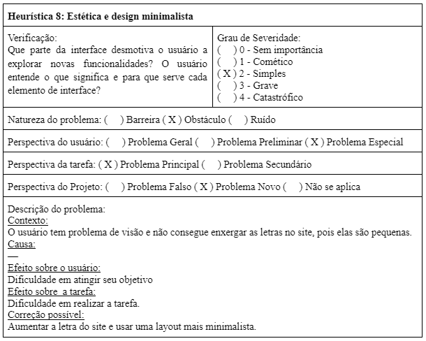

# Avaliação Heurística
A avaliação heurística é um método de avaliação de IHC criado para encontrar problemas de usabilidade durante um
processo de design iterativo (Nielsen e Molich, 1990; Nielse, 1992, 1994b). Esse método de avaliação orienta os 
avaliadores a inspecionar sistematicamente a interface em busca de problemas que prejudiquem a usabilidade.(Barbosa e Silva,p.281).
As figuras 1, 2, 3 são correspondentes à avaliação heurística do site da PMDF, feita pelo integrante Bernardo Pissutti no dia 27/06/2022.
/
||
|:-----------------------------------------------:|
|                    Figura 1                     |

|  |
|:-------------------------------------------------:|
|                     Figura 2                      |

| |
|:-------------------------------------------------:|
|                     Figura 3                      |

## Referências Bibliograficas
Barbosa, S. D. J.; Silva, B. S. da; Silveira, M. S.; Gasparini, I.; Darin, T.; Barbosa, G. D. J. (2021)
Interação Humano-Computador e Experiência do usuário. Autopublicação. ISBN: 978-65-00-19677-1.R

## Histórico de Versões
| Versão | Data       | Descrição         | Autor             |
| ------ | ---------- |-------------------|-------------------|
| 1.0    | 11/07/2022 | Criação da página | Bernardo Pissutti |
