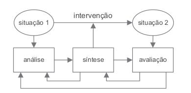
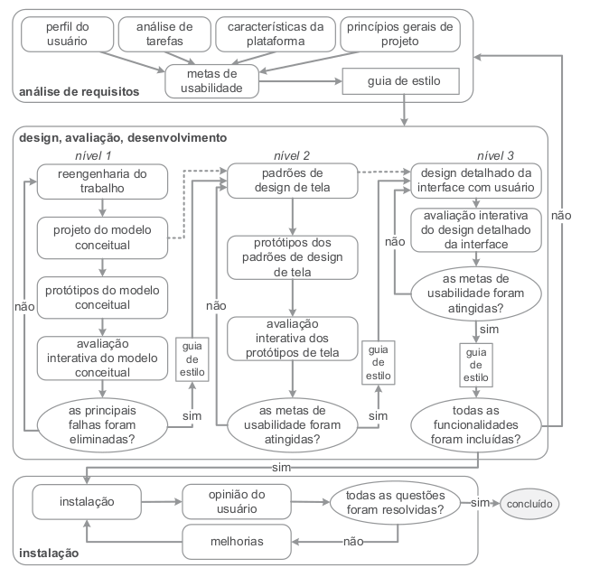

# 
 Processo de Design 

Desde sua concepção e durante todo o seu desenvolvimento, um sistema interativo deve ter o propósito de apoiar os usuários a alcançarem seus objetivos.

O projeto de um sistema interativo é um processo
iterativo de análise, síntese e avaliação, no qual artefatos são coletados e produzidos visando não apenas à
construção do sistema, mas também à promoção de uma boa experiência de uso desse sistema.

## 1. O que é Design?

Primeiro de tudo, precisamos entender o que é um artefato. **Artefatos** são produtos artificiais, fruto da inteligência e do trabalho humano, construídos com um determinado propósito em mente.

Ao analisarmos uma situação, considerando as pessoas, artefatos e processos podemos encontrar problemas, características desagradáveis ou algo que podemos melhorar.
Para resolver esses problemas, diminuir as características desagradáveis e melhorar o que mais for possível, é comum tomarmos algumas atitudes. Essas atitudes envolvem atividades de **design**, descritas graficamente na figura 1. Sendo elas (Lawson, 2006; Lowgren e Stolterman, 2007):
1. a **análise** da situação atual: que envolve estudar e interpretas a situação atual.
2. a **síntese** de uma intervenção: planejar e executar uma intervenção da situação atual.
3. A **avaliação** da nova situação: verificar o efeito da intervenção, comparando a situação analisada anteriormente com a nova situação, atingida após a intervenção.

|                                                                                                                         |
|:---------------------------------------------------------------------------------------------------------------------------------------------------------:|
| Figura 1: Atividades de design envolvidas na intervenção para transformar a situação atual (situação 1) em uma situação desejada (situação 2); Fonte: .   |

Quando se trata de sistemas computacionais, é comum investigarmos todos os elementos envolvidos durante o uso: os usuários com suas características, necessidades e preferências; as atividades e os objetivos em questão, considerando os artefatos e sistemas computacionais utilizados; e o contexto físico, social e cultural de uso ao longo do tempo (Hackos e Redish, 1998; Sharp et al., 2019). Além desses elementos diretamente envolvidos no uso atual desses artefatos, também é preciso conhecer e articular os interesses das pessoas indiretamente envolvidas, como aquela que paga pelo sistema, geralmente conhecida como cliente, e aquela que constrói o sistema, normalmente chamada de desenvolvedor.

## 2. Processo de Design

Como visto anteriormente, o design é um processo que envolve 3 atividades principais:**análise** da situação atual, **síntese** de uma intervenção e a **avaliação** dessa intervenção projetada ou já aplicada à situação atual. Para isso, vários processos de design foram construídos para detalharem essas atividades básicas de uma forma particular, definindo:
- Como executar cada atividade
- A sequência em que elas devem ser executadas
- Quais atividades podem se repetir, e por quais motivos
- os artefatos consumidos e produzidos em cada uma delas
  
Neste trabalho, será empregado a proposta de processo de design de IHC denominada: **Engenharia de Usabilidade de Mayhew**. Esse processo foi escolhido pois é capaz de orientar até designers menos experientes em direção a uma boa solução interativa, pois apresenta perguntas básicas que servem como um guia para o designer. Esse processo consiste em três fases principais: **análise de requisitos, design/avaliação/desenvolvimento e instalação.** As fases podem ser vistas na figura 2 (retirada do livro:  Interação Humano-Computador de BARBOSA et al. (2021, pag.106)) e são citadas a seguir:
1.  Fase de Anaĺise de Requisitos: são definidas as metas de usabilidade com base no perfil dos usuários, análise de tarefas, possibilidades e limitações da plataforma em que o sistema será executado e princípios gerais de design de IHC. As metas de usabilidade costumam ser representadas em "guias de estilos" para auxiliar sua verifcação durante as demais atividades do processo de design.
2.  Design, avaliação e desenvolvimento: Tem por objetivo conceber uma solução de IHC que atenda às metas de usabilidade estabelecidas na fase 1. Essa fase pode ser detalhada em 3 níveis:
    1.  No nível 1, o designer precisa realizar a reengenharia do trabalho, repensando a execução das tarefas para alcançar os objetivos dos usuários, elaborar alternativas de solução do modelo conceitual, elaborar protótipos de baixa fidelidade e avaliar tais protótipos.
    2.  No segundo nível o designer deve estabelecer padrões de design de IHC para a solução sendo concebida, construir protótipos de média fidelidade de acordo com esses padrões e avaliá-los.
    3.  No último nível, o designer realiza o projeto detalhado da interface, com alta fidelidade, para ser implementado.
3.  Instalação: Nesta fase, o designer deve coletar opiniões dos usuários depois de algum tempo de uso. Essas opiniões serão úteis para melhorar o sistema em versões futuras ou até mesmo para apontar a necessidade de desenvolver novos sistemas interativos ainda não previstos.

|                                                                                                 |
|:---------------------------------------------------------------------------------------------------------------------------------:|
| Figura 2: Ciclo de vida para a engenharia de usabilidade de Mayhew; Fonte: Interação Humano-Computador e Experiência do usuário.  |

## Referências Biblioǵraficas
Barbosa, S. D. J.; Silva, B. S. da; Silveira, M. S.; Gasparini, I.; Darin, T.; Barbosa, G. D. J. (2021)
Interação Humano-Computador e Experiência do usuário. Autopublicação. ISBN: 978-65-00-19677-1.R

## Histórico de Versões
| Versão   | Data    | Descrição                   | Autor             | Revisor           |
|----------|---------|-----------------------------|-------------------|-------------------|
| 1.0      | 10/07   | Criação do Artefato: Página | Guilherme Brito 	 | Bernardo Pissutti |
